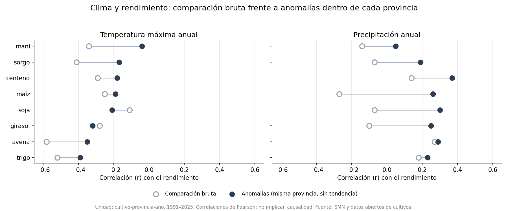
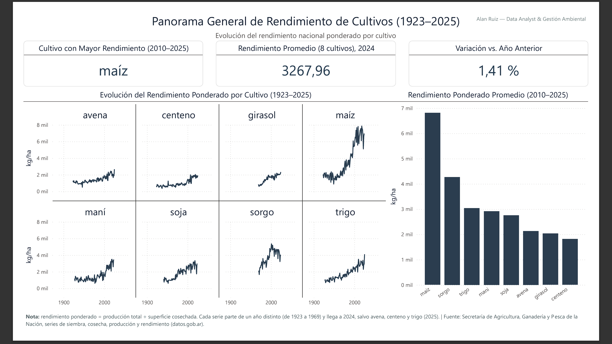
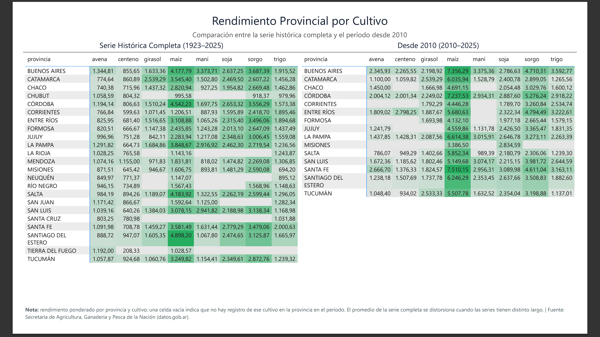
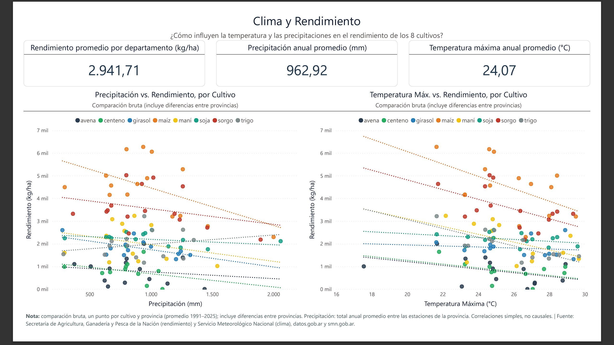
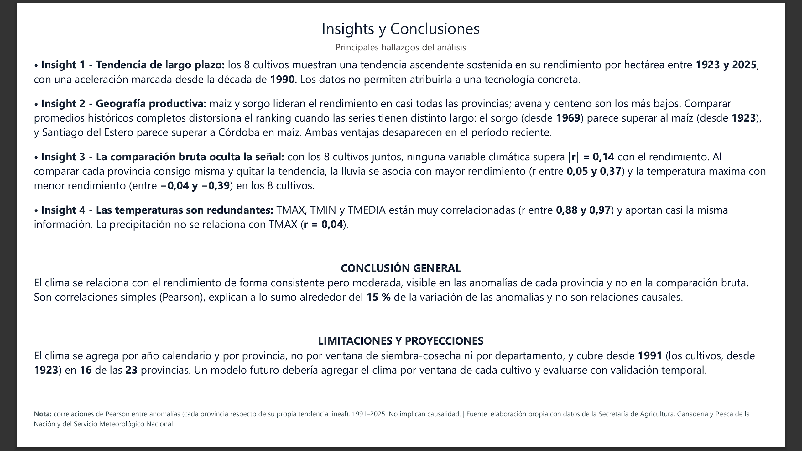

# 🌾 Clima y rendimiento de cultivos en Argentina (1923–2025)
### Análisis de datos end-to-end: Python + SQL + Power BI

---

## 📌 Descripción

Este proyecto estudia cómo evolucionó el rendimiento de ocho cultivos en Argentina durante un siglo (avena, centeno, girasol, maní, maíz, soja, sorgo y trigo) y responde una pregunta concreta: **¿qué tanto se relacionan el clima de cada año y el rendimiento de los cultivos?** Para responderla cruza las series históricas de cultivos, que llegan hasta el nivel de departamento, con el clima anual de cada provincia, construido a partir de los registros diarios del Servicio Meteorológico Nacional (SMN) desde 1991.

Se implementa un pipeline completo de datos (**end-to-end**) que incluye:

- Limpieza y validación de las series de cultivos y de los registros del SMN (Python)
- Fusión de clima y rendimiento por provincia y año (Python)
- Análisis exploratorio con control por geografía y por tendencia tecnológica (Python)
- Modelado relacional y vistas analíticas (SQLite)
- Visualización e interpretación (Power BI)

---

## 📈 Resultados principales

- El rendimiento de los 8 cultivos subió de forma sostenida. Comparando los primeros y los últimos cinco años de cada serie, el maíz pasó de 2.037 a 6.563 kg/ha, el trigo de 879 a 3.108 y la soja de 1.075 a 2.637.
- Maíz y sorgo lideran el rendimiento en casi todas las provincias; avena y centeno son los más bajos. Desde 2010, el promedio de los rendimientos nacionales anuales es de 6.811 kg/ha en maíz y 4.271 en sorgo.
- **Un promedio histórico engaña si las series tienen distinto largo.** Con toda la serie, el sorgo (1969 en adelante) parece rendir más que el maíz (1923 en adelante) y Santiago del Estero parece superar a Córdoba en maíz. En ambos casos, la ventaja desaparece al comparar solo el período reciente: las series que se concentran en años recientes se benefician de la tendencia ascendente. En maíz, el 90,6 % de la producción histórica de Santiago del Estero ocurrió después del año 2000.
- **En la comparación bruta, clima y rendimiento se relacionan poco.** Con los 8 cultivos juntos, ninguna variable climática supera |r| = 0,14. Por cultivo, la temperatura máxima tiene correlación negativa (entre −0,13 y −0,55) y la precipitación no muestra un patrón común.
- **Al comparar cada provincia consigo misma y quitar la tendencia tecnológica, aparece una señal consistente pero moderada.** En los 8 cultivos, los años más lluviosos que la tendencia de la provincia coinciden con rendimientos más altos (r entre 0,05 y 0,37) y los más cálidos con rendimientos más bajos (entre −0,04 y −0,39). Es una señal de a lo sumo el 15 % de la variación de las anomalías, no una relación causal.
- Soja parecía el cultivo menos sensible al clima en la comparación bruta (|r| ≤ 0,13), pero muestra una de las respuestas más claras a la lluvia en las anomalías (r = 0,30). Lo que ocultaba esa señal era la geografía.



---

## 🎯 Objetivos

- Describir la evolución del rendimiento de 8 cultivos entre 1923 y 2025, a nivel nacional y provincial
- Construir el clima anual de cada provincia a partir de los datos diarios del SMN
- Medir la relación entre clima y rendimiento sin confundirla con la geografía ni con la tecnología
- Diseñar un dashboard interactivo para el análisis en BI

---

## 🔄 Metodología

**1. Limpieza de cultivos (Python, `notebook/01-cultivos_limpieza.ipynb`)**
- Consolidación de 8 series históricas en un solo archivo (138.926 registros cultivo-departamento-año)
- Corrección de errores de codificación en provincias y departamentos
- Normalización de nombres de departamento al nomenclador oficial del INDEC (Resolución 55/2019)
- Corrección de tres registros con superficie sembrada y cosechada invertidas
- Recuperación por cálculo de 209 valores deducibles (rendimiento = producción × 1000 / superficie cosechada); quedan unas 6.200 filas sin rendimiento, casi todas anteriores a 1968

**2. Limpieza del clima del SMN (Python, `notebook/02-clima_limpieza.ipynb`)**
- 1,17 millones de registros diarios de 92 estaciones, 1991–2026
- Eliminación de filas corruptas (encabezados repetidos como datos)
- Tratamiento del convenio del SMN: precipitación vacía = 0 mm y `S/D` = dato faltante
- Verificación de coherencia física (temperaturas, humedad, precipitación, viento)

**3. Fusión (Python, `notebook/03-fusion_clima_cultivos.ipynb`)**
- Clima anual por provincia: promedio anual para temperaturas, humedad y demás variables
- Precipitación anual: total anual de cada estación (exigiendo dato en al menos el 80 % de los días) y promedio entre las estaciones de la provincia
- Unión con cultivos por provincia y año: 47.358 registros con clima, de 16 provincias

**4. Exploración (Python, `notebook/04-exploracion_clima_cultivos.ipynb`)**
- Evolución por cultivo, comparación entre provincias y ventana reciente (2010–2025)
- Correlación clima-rendimiento agrupada y por cultivo, y multicolinealidad entre variables climáticas
- Control por geografía y por tendencia: correlación de las anomalías de cada provincia respecto de su propia tendencia

**5. Modelado de datos (SQLite, `notebook/05-sql_consultas.ipynb`)**
- Base `proyecto_agro.db` y 4 vistas analíticas, verificadas contra los cálculos de pandas
- Exportación de cada vista a CSV en `powerbi/`, que es lo que carga el dashboard

**6. Visualización (Power BI)**
- Dashboard interactivo de cuatro páginas, con medidas DAX

---

## 📊 Dashboard (Power BI)

Power BI carga los CSV de [`powerbi/`](powerbi/), uno por vista de la base SQL. Los datos son un corte histórico que no cambia, así que no hace falta una conexión a la base. El dashboard se estructura en cuatro páginas:

- **Panorama general de rendimiento**
- **Rendimiento provincial por cultivo**
- **Clima y rendimiento**
- **Insights y conclusiones**

También está disponible en PDF: [`dashboard/reporte-dashboard-cultivos-clima.pdf`](dashboard/reporte-dashboard-cultivos-clima.pdf).

### 🖼️ Visualizaciones

#### Panorama


#### Provincias


#### Clima y rendimiento


#### Insights


---

## 🗂️ Fuente de los datos

- **Cultivos:** series históricas de superficie sembrada y cosechada, producción y rendimiento por cultivo y departamento, publicadas como datos abiertos del Gobierno nacional. Archivos en `data/raw/`. Fuente exacta por documentar.
- **Clima:** Servicio Meteorológico Nacional, [datos meteorológicos diarios](https://www.smn.gob.ar/descarga-de-datos). Los dos archivos grandes (94 MB) no se versionan: la descarga se explica en [`data/raw/LEEME.md`](data/raw/LEEME.md). Los diccionarios de variables están en `references/`.
- **Códigos geográficos:** INDEC, Resolución 55/2019, Anexo II (nomenclador de provincias y departamentos), en `references/`.

---

## ⚠️ Limitaciones

- **Clima desde 1991:** los cultivos empiezan en 1923, así que casi 70 años de la serie no tienen contexto climático.
- **Clima por provincia, no por departamento:** las estaciones del SMN solo se ubican por provincia, y todos los departamentos de una provincia comparten el mismo clima en un año.
- **Año calendario, no campaña:** el clima se agrega de enero a diciembre, no por la ventana de siembra y cosecha de cada cultivo. Es la limitación que más probablemente diluye la señal.
- **Cobertura de provincias:** el cruce con clima cubre 16 de las 23 provincias con datos de cultivos. Las otras siete (Chubut, La Rioja, Mendoza, Neuquén, San Juan, Santa Cruz y Tierra del Fuego) no tienen registros de cultivos desde 1991, que es cuando empieza el clima.
- **Variables desde 2021:** `VTO_MVEL`, `VEL_MED`, `HUM_REL` y `NUB_TOTAL` solo existen desde 2021 y no se usan en las conclusiones.
- **Correlaciones, no causalidad:** son correlaciones de Pearson sin pruebas de significación; las provincias comparten el clima de cada año y las observaciones no son independientes. La tendencia lineal es una forma simple de separar el efecto de la tecnología.
- **Años parciales:** la serie de avena, centeno y trigo llega a 2025 y las demás a 2024, por lo que la comparación del último año entre cultivos no es directa.

---

## 🚀 Cómo reproducirlo

Requiere Python 3.11 o superior y Power BI Desktop solo para abrir el `.pbix`.

```bash
git clone https://github.com/alandruiz/clima-rendimiento-cultivos-argentina.git
cd clima-rendimiento-cultivos-argentina

python -m venv .venv
.venv\Scripts\activate          # en macOS/Linux: source .venv/bin/activate
pip install -r requirements.txt

jupyter lab
```

Abrí los notebooks desde la carpeta `notebook/` y ejecutalos en orden (*Restart & Run All*):

1. `01-cultivos_limpieza.ipynb` lee `data/raw/` y guarda los cultivos limpios en `data/processed/`.
2. `02-clima_limpieza.ipynb` y `03-fusion_clima_cultivos.ipynb` construyen el clima provincial y la fusión. Necesitan los archivos del SMN descriptos en [`data/raw/LEEME.md`](data/raw/LEEME.md); sin ellos, se puede seguir desde el notebook 04 con las tablas ya incluidas.
3. `04-exploracion_clima_cultivos.ipynb` hace el análisis y genera el gráfico de `images/`.
4. `05-sql_consultas.ipynb` crea `sql/proyecto_agro.db` y exporta las vistas a `powerbi/`.

Para abrir el dashboard hay que apuntar Power BI a la carpeta `powerbi/`: los pasos, las consultas y las medidas DAX están en [`powerbi/consultas_power_query.md`](powerbi/consultas_power_query.md).

---

## 📁 Estructura del repositorio

```
clima-rendimiento-cultivos-argentina/
├── dashboard/   dashboard de Power BI (.pbix) y su versión en PDF
├── data/
│   ├── raw/         series de cultivos, estaciones del SMN y LEEME (ver LEEME)
│   ├── interim/     cultivos consolidados y tablas de apoyo de la limpieza
│   └── processed/   cultivos limpios y fusión clima-cultivos
├── images/      gráfico del análisis y capturas del dashboard
├── notebook/    01 cultivos, 02 clima SMN, 03 fusión, 04 exploración, 05 SQL
├── powerbi/     CSV de las vistas, que carga el dashboard, y sus consultas y medidas
├── references/  nomenclador del INDEC y diccionarios de variables del SMN
├── sql/         base SQLite (proyecto_agro.db)
├── src/         función de consolidación de las series de cultivos
├── LICENSE
├── readme.md
└── requirements.txt
```

---

## 💡 Próximos pasos

- Agregar el clima por ventana de siembra y cosecha de cada cultivo, en lugar del año calendario
- Buscar fuentes de clima anteriores a 1991 para cubrir las décadas hoy sin contexto climático
- Probar modelos que combinen clima, provincia y tendencia, y medir su capacidad predictiva con validación temporal
- Incorporar variables que expliquen la brecha de rendimiento, como el tipo de suelo y el manejo

---

## 📄 Licencia

El código se publica bajo licencia MIT (ver [`LICENSE`](LICENSE)). Los datos conservan las condiciones de sus fuentes (datos abiertos del Gobierno nacional, SMN e INDEC).

---

## 👤 Autor

**Alan Ruiz** — Data Analyst & Gestión Ambiental

- [LinkedIn](https://www.linkedin.com/in/alandruiz/)
- [GitHub](https://github.com/alandruiz/clima-rendimiento-cultivos-argentina)
